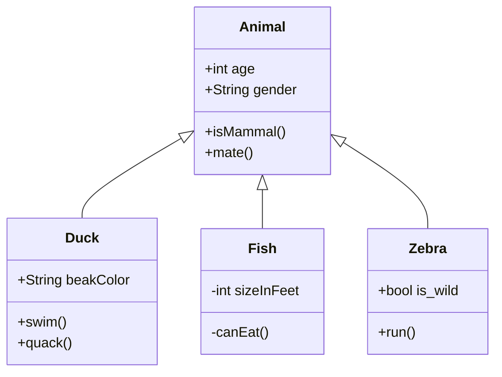

# 700105 Simulation and Concurrency Lab Book

## Final Lab

*Date*

### System Architecture

*System architecture, including where threads and networking have been used (1000 words max), plus UML diagrams*

### Simulation

*How the motion physics has been implemented for the simulated objects, and how the collision detection and response has been implemented between the simulated objects and the other elements in the scene using diagrams where appropriate (1000 words max)*

Marks will be lost if the word limit is exceeded.

We recommend [mermaid](https://mermaid.ai/) for UML diagrams.

